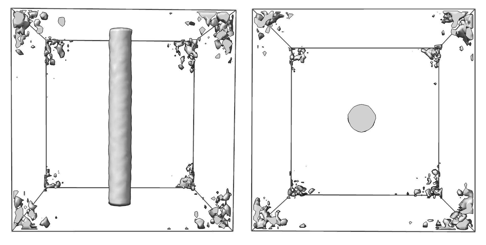
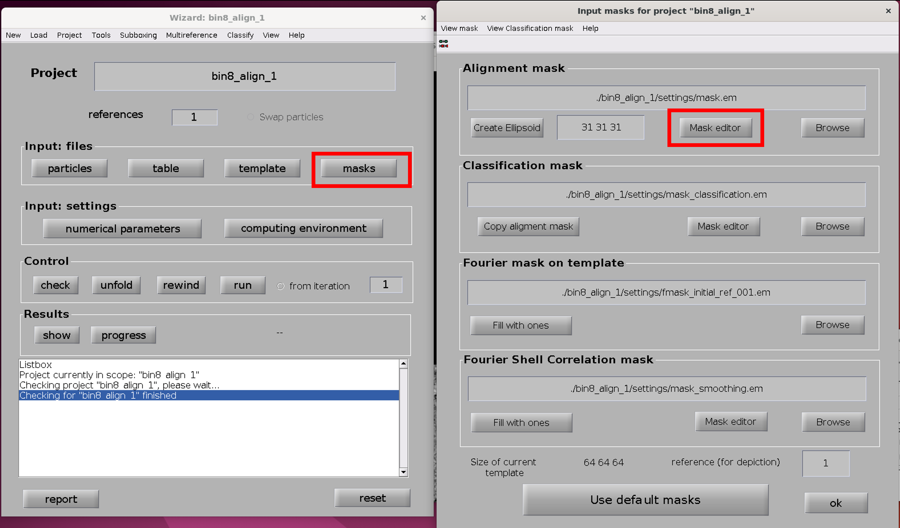
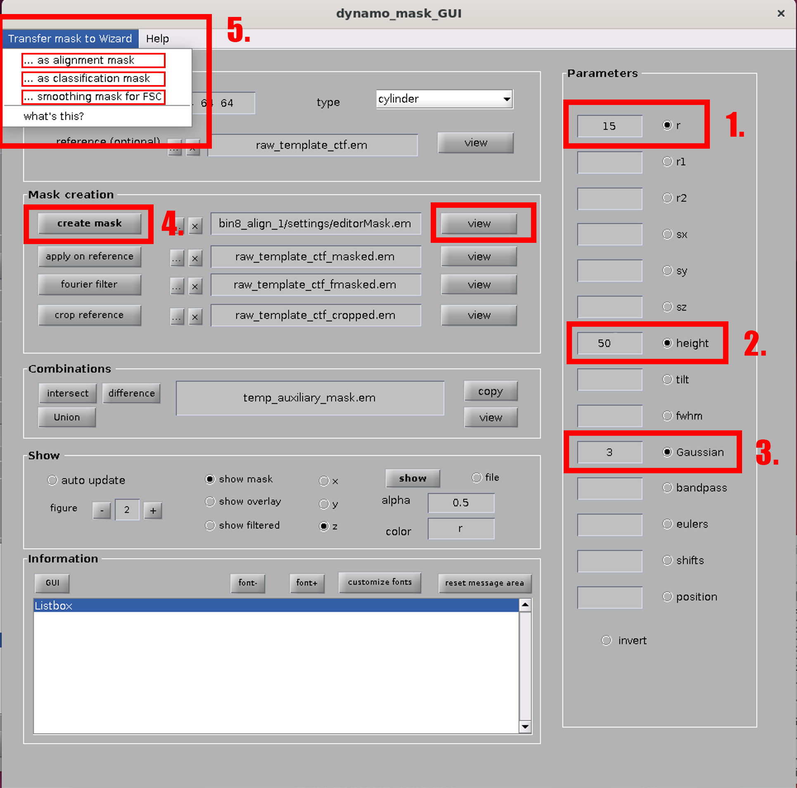
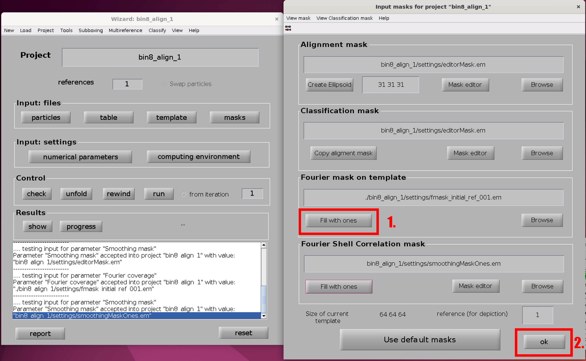
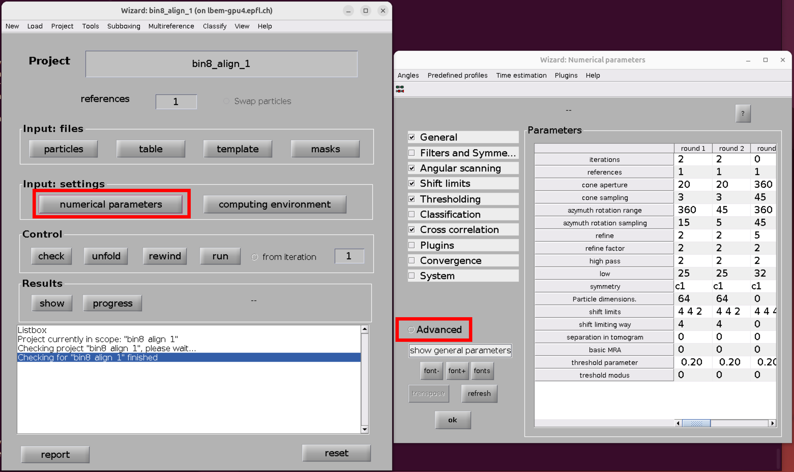

# Generate an initial model with Dynamo

## Average tube at bin 8

1. Move into ```warp/dynamo``` and create a project directory called ```dynamo_project_b8```:

    ```bash
    mkdir dynamo_project_b8 && cd dynamo_project_b8
    cp ../particles_edit.tbl ./particles_edit.tbl
    mv ../filamentsData_ctf ./
    ```


    With the dynamo software, randomize the azimuth (=rot) angle and make a first average:
    ```matlab
    dynamo

    T = dread('particles_edit.tbl');
    T2 = dtrandomize_azimuth(T);
    dwrite(T2,'particles_edit_mod.tbl');
    % Generate average (should be a tube)
    oa = daverage('filamentsData_ctf','t','particles_edit_mod.tbl','mw',50);
    dwrite(oa.average,'raw_template_ctf.em');
    ```

    Check the output volume ```raw_template_ctf.em``` in ChimeraX. In ChimeraX, don't forget to flip the volume:
    ```vop scale #1 factor -1```

    

## Aligned tube at bin 8

2. Generate a new dynamo project with the tube as a template:
    ```matlab
    dcp.new('bin8_align_1', 'd', 'filamentsData_ctf','template','raw_template_ctf.em','masks','default','t','particles_edit_mod.tbl');

    dcp bin8_align_1
    ```

    The dynamo window will open. 
    
3. Generate a mask: Click on "masks", then "masks editor".

    

    Generate a mask with the following specifications:
    | Parameter    | Value      |
    | --------     | -------    |
    | r            | 15         |
    | h            | 50         |
    | Gaussian     | 3          |

    Then, click "create mask", and you can "view" it to check. Once you are happy, click "Transfer mask to Wizard" (top left) and hit all 3 options individually (alignment mask, classification mask and smoothing mask). Close the mask editor.

    

4. In the "Input mask" window, hit "Fill with ones" for "Fourier mask on template", then OK:

    

5. Set the numerical parameters of the alignment (only the parameters to change are listed, leave the rest default):

    | Parameter                 | round 1    | round 2    |
    | --------                  | -------    | -------    |
    | iterations                | 2          | 2         |
    | cone aperture             | 20         | 20         |
    | cone sampling             | 3          | 3          |
    | **Advanced:** cone flip   | 2          | 2          |
    | azymuth rotation angle    | 360        | 45          |
    | azymuth rotation sampling | 15         | 5          |
    | refine                    | 2          | 2          |
    | refine factor             | 2          | 2          |
    | high pass                 | 2          | 2          |
    | low                       | 25         | 25          |
    | particle dimensions       | 64         | 64          |
    | shift limits              | 4 4 2      | 4 4 2          |
    | shift limiting way        | 4          | 4          |

    

6. Set the computing environment to the specifications of your computing system.  
    In our case: *GPU standalone*,
    | Parameter    | Value      |
    | --------     | -------    |
    | GPU identifier            | 0 1 2 3         |
    | CPU core            | 1         |
    | Parallelize     | 50          |

7. In the dynamo main window, hit "check", then "unfold". Close dynamo.

8. In the terminal, leave the dynamo environment (```ctrl + c```) and run the project executable:
    ```bash
    ./bin8_align_1.exe
    ```
    and wait for the alignment to finish (can take >8 hours with ~7000 particles).

## Search for Symmetry
9. When you see helical symmetry in your average, search for that symmetry:

    ```bash
    # Copy the volume and tbl file of the last iteration to your dynamo project folder
    cp bin8_align_1/results/ite_0004/averages/average_ref_001_ite_0004.em ./
    cp bin8_align_1/results/ite_0004/averages/refined_table_ref_001_ite_0004.tbl ./
    # Convert .em volume to .mrc
    e2proc3d.py --mult=-1 average_ref_001_ite_0004.em average_ref_001_ite_0004.mrc
    # Set pixel size
    relion_image_handler --i average_ref_001_ite_0004.mrc --o average_ref_001_ite_0004.mrc --force_header_angpix 15.84
    # Search symmetry in Relion
    relion_helix_toolbox --i average_ref_001_ite_0004.mrc --twist_min 0.5 --twist_max 2 --rise_min 4.5 --rise_max 4.9 --z_percentage 0.3 --search --cyl_outer_diameter 200 --angpix 15.84
    # Impose symmetry to the average (change twist and rise to the optimal values from previous command)
    relion_helix_toolbox --i average_ref_001_ite_0004.mrc --twist 1.01 --rise 4.8 --z_percentage 0.3 --impose --cyl_outer_diameter 200 --angpix 15.84 --o average_ref_001_ite_0004_sym.mrc
    # Set pixel size back to 1 for Dynamo
    relion_image_handler --i average_ref_001_ite_0004_sym.mrc --o average_ref_001_ite_0004_sym.mrc --force_header_angpix 1
    # Convert .em back to .mrc for Dynamo
    e2proc3d.py --mult=-1 average_ref_001_ite_0004_sym.mrc average_ref_001_ite_0004_sym.em
    ```

## Gold-standard refinement at bin 8

9. To generate two half particle sets fo the gold-standard FSC calculation, we need to make sure that particles originating from the same filament end up in different particle sets.  
    ```
    Wen-Lu's ipynb to generate 2 half-sets
    ```

10. Create a new dynamo project:  
    
    ```matlab
    dynamo
    
    dcp.new('abp_align', 'd', 'filamentsData_ctf','template','average_ref_001_ite_0004_sym.em','masks','default','t','refined_table_ref_001_ite_0004_mod.tbl');
    ```