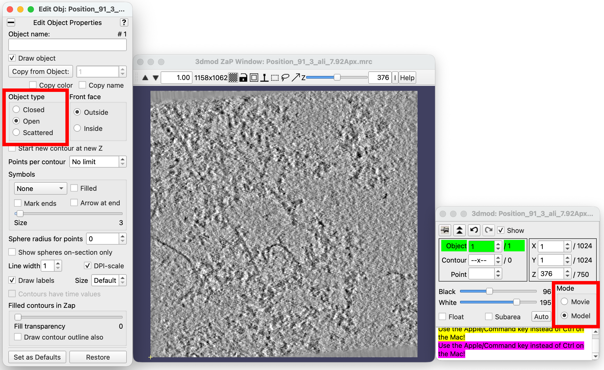
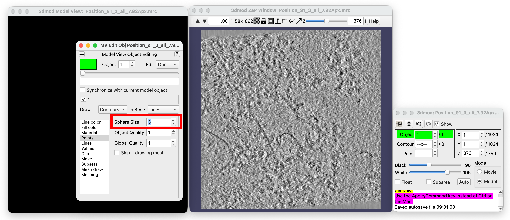
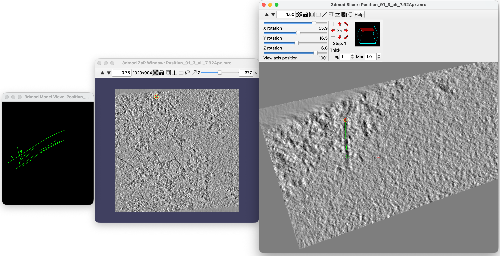

# Pick filaments in IMOD and extract coordinates

1. Open the tomogram in ```3dmod```.
2. Select mode to **model**.
3. Edit >> Object >> Type...: In the object window, set Object type to **Open** and close the object window.

    

4. Press ```v``` to open Model window.

5. In Model window, Edit >> Object.

6. In the Object window, choose the desired sphere size for visualisation (e.g., 3).

    

7. In the ZaP window: 
    - Go to one end of one filament 
    - Click mouse middle key to create a point for the new Contour 
    - Move along the Z with “page up&down” to the next slices 
    - Click mouse middle key to create the next point 
    - Make a few points until the other end of the filament 
    - Left click on an empty space to unselect the current Contour 
    - To the next filament and repeat...
    - Press ```\``` to open the slicer view, where you can change the tomogram rotation to better visualize your filaments in any direction.

    

    Useful shortcuts:
    - Press ```n``` to start a new filament
    - ```Shift + d``` to delete a filament

8. After picking, save the model as ```XXX_filaments.mod``` (on ZaP window, press ```s```).

9. Add points between start-end coordinates and create a coordinate file:
    ```shell
    # Add points between start-end, every 1 (binned) pixel
    addModPts *_filaments.mod 1 
    # Convert to coordinate file
    model2point -c XXX_filaments_PtsAdded.mod XXX_filaments_PtsAdded.coords
    ```
    This will create the txt file with 4 columns: [filament_ID X Y Z]. The column order needs to be changed to [X Y Z filament_ID] with this command:
    ```bash
    awk '{print $2, $3, $4, $1}' XXX_filaments_PtsAdded.coords > XXX_filaments_PtsAdded_XYZI.coords
    ```

10. Export particles with cryolo:
    ```shell
    cryolo_boxmanager_tools.py coords2star -i *_XYZI.coords -o out_warp/ --scale 4 --apix 1.98 --mag 64000 --flipratio 0.5
    ```
    In the output .star file, correct the name of the tomostar file:
    ```bash
    sed -i 's/Position_91_3_ali_7p92Apx_filaments_PtsAdded_.tomostar/Position_91_3_ali.tomostar/g' out_warp/particles_warp.star
    ```
    

    
End of filament picking!

---

<p align="center">
  <a href="tomo-reconstruction.md">← Back</a> | <a href="dynamo-extraction.md">Next →</a>
  <br><br>
  <a href="index.md">Home</a>
</p>